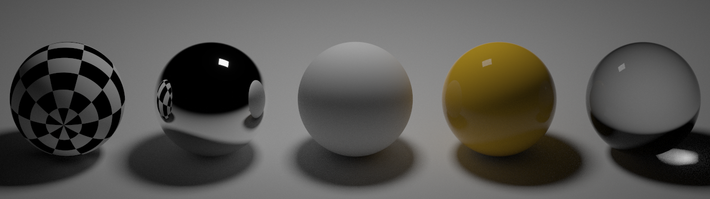

## work-in-progress

### clone the repo:
```
git clone --recursive https://github.com/adruomnfd/pine
```

### build with CMake:
```
cmake -Bbuild
cmake --build build
```

### usage:
```
build/pine scenes/nspheres.txt result.bmp
```
all the settings like spp or image size are specified in the scene file,
and after rendering is finished, you can find the result `result.bmp` in the same folder  

