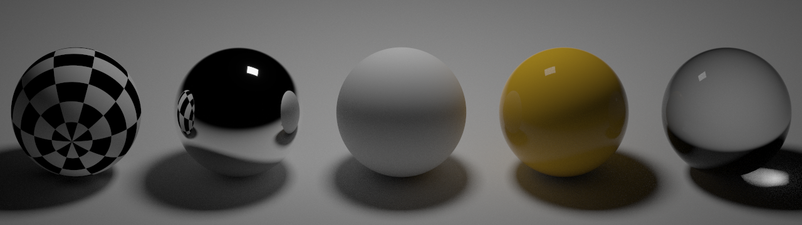

## work-in-progress

### build with CMake:
```
cmake -Bbuild
cmake --build build
```

### example:
```
build/pine scenes/nspheres.txt result.bmp
```
All the settings like `samplesPerPixel` or `filmSize` are specified in the scene file (`scenes/nspheres.txt`).  
After rendering is finished, you can find the result `result.bmp` in the same folder  

